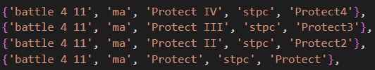

## Introduction

First off, let me say that I absolutely love XIVHotbar and really appreciate the work that SirEdeonX and Akirane did. However, there were a few bugs that needed fixing and some features I wished it had, but it seems that project is no longer supported. That being said this is a heavily modified version of xivhotbar. I originally wanted to fix a few bugs and change some minor things, but one thing led to another and I ended up fixing a lot and adding several nice features. My initial intention was to do this for personal use, but now that I have added so much I want to make it public and see if anyone else likes what I have done. Thus, XIVHotbar2!

Additionally, I also wanted to have this public so that it could get approved for a private server [HorizonXI.com](https://horizonxi.com/). Go check it out! 

## Why XIVHotbar2?

While a considerable portion of this addon is the original code/design by SirEdeonX and Akirane. I have made some strict changes, including major features (see below) that have no enable/disable toggle and are forced. Additionally, I pretty much exclusively play 75 cap era private servers, and thus many design decisions have this in mind. Therefore, previous xivhotbar users might find that this addon is not for them.

Please note, I have only tested this addon on private servers so there may be issues if this is used on retail. However, most of the private servers I have played on use the retail client. The bigger issue is potential problems with content beyond level 75. Please let me know any issue you experience using this addon on retail.

# New Features

## Level Sync and Level Cap

This is the main feature I wanted to add. Often on era private servers you are level syncing in parties or in level capped zones. It can be a bit annoying to constantly remember what spells and abilities you have available to you under capped level conditions. Thus, when being level sync'd or being in a level capped zone, any skill, ability, or weaponskill that is no longer available to you will be removed from the hotbar until the sync conditions are removed. 

Level 75 RDM (with all spells learned) zoning into Promyvion-Holla. <br>


**This also works the exact same way when level syncing.

**Dia II (31) changes to Dia (1). This is explained below in the "Tiered Spells Sharing Hotbar Slots" section.

## Unlearned Spells and Unacquired Abilities/Weaponskills:

**Spells:**
Previously, spells setup on the hotbar in a JOB.lua file that were not yet learned in-game would still show up on the hotbar and appear lit up and useable. Now in this situation spells will appear dimmed until they are learned. Upon learning a spell the spell will immediately appear lit and be useable. When a player has not met the level requirement for a spell it will not show up on the hotbar at all.

Using a scroll of Cure III.<br> 


**Abilities:**
If an ability is added to a JOB.lua file it will not appear on the hotbar until the player has reached the required level to obtain the ability. In level capped situation if you lose access to the ability it will disappear from the hotbar.

**Weaponskills:**
If a weaponskill is added to a JOB.lua file it will not show up on the hotbar unless that weaponskill has been learned in-game. In level capped situations if you lose access to the weaponskill it will disappear from the hotbar.


## Tiered Spells Sharing Hotbar Slots:

Another feature I wanted to add was having one hotbar slot hold multiple spells which would display depending on level. For example, Dia is a commonly used spell, but once Dia II is acquired it is not used quite as often. Thus, when setup properly in the JOB.lua file Dia II will take priority over the slot Dia was originally in once you reach the appropriate level for Dia II and assuming Dia II has been learned. 

This works seamlessly with the level sync feature above as well. For example, syncing down to level 30 will turn Dia II back into Dia. 

In order to set this up simply add both spells to the JOB.lua file with the same slot specified {battle 4 11} in Descending order as seen below.
 


NOTE: In the case that a player is high enough level to use a higher tier spell, but has not learned that spell yet the lower tier spell will still appear on a hotbar with an asterisk appended to the spell title. This asterisk indicates that a spell/ability setup on this slot has not been learned yet. This asterisk will also appear if a lower tier spell is also not learned yet. For example the player has learned Dia II but has not learned Dia yet. The slot title/name will appear as "Dia II*" indicting there is a spell to learn in this slot. 


# Improved Features

## Summoner Changes:

I ran into several issues with the Summoner hotbar that was added to this Hotbar such as the summons spells getting out of sync and other various things.

Now, a summon's abilities will only show up on the hotbar when the summon is successfully summoned. Additionally, the abilities will remove themself from the hotbar when the pet is released, dies or insufficient mp. Also, pet commands: release, attack etc. do not appear on hotbar unless a summon is present.


** All Blood Pact: Ward abilities share a cooldown and All Blood Pact: Rage abilities share a cooldown on the hotbar.
** Pet commands do not show up on hotbar unless player has an active pet.

## Weaponswitching and Weaponskills:

The weaponswitching feature mostly worked in xivhotbar but I did run into some issues. It should work much better now with the added benefit of weaponskills not showing up on hotbar if they have not been learned yet. Occasionally weapons and hotbar weaponskills will get out of sync. Easy fix for this is to unequip the weapon and reequip it.

Note: If playing Ranger, XIVHotbar2 with prioritize weapon changes to the range slot over main slot. This is a temporary solution to allow rangers to use weaponswitching with Marksmanship and Archery and not have their main hand weapons interfere.  

## Getting Started

1. Put the addon in your Windower 4/addons folder. Next, inside the data folder within the XIVHotbar2 folder create a folder with your character(s) name.
2. Inside your <name-of-character> folder create a general.lua and <job>.lua for each job you want to setup. Additionally, you can copy over the premade templates I have made in the Data/Technyze folder. The General.lua is the second page on the hotbar that is consistent across all jobs. Highly recommend downloading notepad++ for editing these files. 

```
Location: Windower 4/addons/xivhotbar2/data/<name-of-character>/general.lua
and
Location: Windower 4/addons/xivhotbar2/data/<name-of-character>/<job>.lua
```
3. The below image is the default layout and positioning on a game running in 1080p. Most of this layout can be adjusted in the settings.xml. <br>


4. Add the load command to your windower init.txt
```
Location: Windower 4/scripts/init.txt
```
```
Command: //lua load xivhotbar2
```
5. Opening the game and logging into your character will generate a settings.xml based on the defaults.lua file (Do not edit the defaults.lua file). 
Only edit your settings through the settings.xml file. A list of available options to edit is detailed below in the "UI Changes" section. 
```
Location: Windower 4/addons/xivhotbar2/data/settings.xml
```
6. You setup all your keybinds in the keybinds.lua file.
```
Location: Windower 4/addons/xivhotbar2/data/keybinds.lua
```
7. You can move your hotbars around in-game with the '//htb move' command. To save your new hotbar locations simply use the '//htb move' command again.
```
Command: //htb move
```

NOTE: When saving your hotbar positions with the '//htb move' command the new locations are saved in the settings.xml file at the bottom inside new xml tags 'Your-Character-Name' -> 'Hotbar' -> 'Offsets'.
I recommend after saving these new positions to copy them over to the Offset tags inside the 'Global' tag to keep hotbar positions consistent between characters. The 'First' tag refers to the first hotbar. Other tags for the other hotbars will appear once they've been moved. Once you finalize your positions you can delete the 'Your-Character-Name' section entirely to prevent these offsets from being used.

```
<your-character-name>
	<Hotbar>
		<Offsets>
			<First>
				<OffsetX>740</OffsetX>
				<OffsetY>530</OffsetY>
			</First>
		</Offsets>
	</Hotbar>
</your-character-name>
```

#### Coming from XIVHotbar?

If you've used previous versions of XIVHotbar, simply download this version and transfer over your Data/Your-Character-Name folder. All your previous setup actions will load normally to their respective hotbars. However, prepare to setup hotbar locations and other various settings again.

# Understanding the JOB.lua and General.lua files

Setting up your desired actions on XIVHotbar2 follows the exact format as XIVHotbar. If you have not used XIVHotbar before I recommend reading the information below and looking at the premade templates in the /Data/Technyze folder inside the XIVHotbar2 folder. 

When loading the addon or switching main jobs, this addon will search for the JOB.lua that is consistent with your current main job in-game inside your 'Your-Character-Name' folder.


## Hotbar Action Format

```lua
xivhotbar_keybinds_job['Table Type'] = { 
	{'Slot Designation', 'Action Type', 'Action Name', 'Target Type', 'Action Title', 'Action Image'},
}
```
1. **Table Type:** 
   - 'Base': Base is the name designation for a table that is associated with your current mainjob. Actions associated with your main job should be inside this table. 
   - 'Job': If table name is a job abbreviation (WAR, WHM etc.) then this is a table designated for your sub job actions. Actions associated with your subjob should be inside this table.
   - 'Weapon Type': If table name is a weapon type then this table is designated for actions associated to your current main hand weapon equipped. Current supported weapon types names are: Hand-to-hand, Dagger, Sword, Great Sword, Axe, Great Axe, Scythe, Polearm, Katana, Great Katana, Club, Staff, Bow, Marksmanship. This is case-sensitive. Weaponswitching must be enabled in settings.xml.
   - 'Stances': Stances refer to various different modes that certain jobs can put themself in. Such as Scholar in Light-Arts mode versus Dark-Arts Mode or even for Summoner Carbuncle Mode, Ifrit Mode, etc. All summon names are supported but are case-sensitive. Other currently supported stances are Light-Arts and Dark-Arts for Scholar. 
2. **Slot Designation**: 'Environment Hotbar# Slot#' - All three values must be present inside quotation marks for every action.
	- Environment:[battle|b|field|f] - 'b' and 'f' can be used as shorthand. 'Battle' refers to the 'Main' hotbar bar and 'Field' refers to the 'General' hotbar.
	- Hotbar#:[1|2|3|4|5|6] 
	- Slot#[1|2|3|4|5|6|7|8|9|10|11|12]
3. **Action Type:** [ma|ja|ws|input|macro|pet]  
4. **Action Name:** Exact spelling of Spell/Ability/Weaponskill etc in-game. Not case-sensitive. Cannot be blank. 
5. **Target Type:** [me|t|st|stpc|stnpc|bt|pet] - Can be blank if action type is input/macro
6. **Action Title:** The name you want displayed on the hotbar slot for this specific action. Can be blank.
7. **Action Image:** Can be blank/removed. If blank/removed action will display the default image if available in the images/icons folder. Otherwise specify the file name of the image in the images/icons/custom folder. 

##### Example 1: Action for Main Job
```lua
xivhotbar_keybinds_job['Base'] = { 
	{'battle 1 1', 'ma', 'Cure', 'stpc', 'Cure'},
}
```
This action will appear on the 'Main'/'Battle' Environment on the first hotbar in the first slot. Its targeting mode is set to stpc. It will have the text 'Cure' as a label, and it will use the default image for Cure. 

##### Example 2: Action for Sub Job
```lua
xivhotbar_keybinds_job['WHM'] = {
  {'battle 2 1', 'ma', 'Poisona', 'stpc', 'Poisona'},
}
```
This action will appear when your sub job in game is White Mage on the 'Main'/'Battle' Environment on the second hotbar in the first slot. It will have the text 'Poisona' as a label, and it will use the default image for Poisona. 

##### Example 3: Action for General/Field Environment
```lua
xivhotbar_keybinds_general['Root'] = {
	{'field 5 7', 'input', '/sea Rolanberry', '', 'Rolan', 'check'},
}
```
This action will appear on the 'General'/'Field' Environment on the fifth hotbar in the seventh slot. The action type is 'input' so the following command will be input into the in-game chat. There is no targeting type because input/macro does not need targets. It will have text 'Rolan' as a label. Also, it will use the check.png file in the 'images/icons/custom' folder.

##### Example 4: Action for a Summoner
```lua
xivhotbar_keybinds_job['Carbuncle'] = {
	{'battle 3 1', 'ja',  'Poison Nails', 't', 'Nails','summons/carbuncle'}
}
```
This action will appear on your 'Main'/'Battle' Environment on your third hotbar in the first slot when carbuncle has been summoned. The action type set here is 'ja' because job abilities are pet abilities, but 'pet' would also work here. The action name is 'Poison Nails' and the targeting type is target. The action will appear on the hotbar with the label 'Nails' and a custom image is set reference the carbuncle.png in the 'images/icons/custom/summons' folder. This action will disappear from the hotbar when carbuncle dies or is released.


##### Example 5: Action for a Weaponswitching
```lua
xivhotbar_keybinds_job['Sword'] = {
  {'battle 1 8', 'ws', 'Savage Blade', 't', 'Savage', 'ws'},
}
```
This action will appear on your 'Main'/'Battle' Environment on the first hotbar in the eighth slot when a Sword is equipped. The action type 'ws' is weaponskill and the action is 'Savage Blade' and the target is target. Action will have the label 'Savage' and the action's image is a custom image named ws.png is the 'images/icons/custom' folder. Note: This action will not appear if the specified weaponskill has not been learned yet. Note, it will not appear if weaponswitching is not enabled. 

##### Example 6: Scripted Macro Action
```lua
{'battle 3 3', 'macro','input /ja "Sneak Attack" <me>;wait 1;input /ja "Trick Attack" <me>;wait 1;input /ws "Viper Bite" <t>','','sataVB',''},
```
This action will appear on your 'Main'/'Battle' Environment on your third hotbar in the third slot. The action type is a 'macro' which means you will be able to execute a series of actions in sequence similar to an in-game macro. The following command must follow this exact format to work. Each action seperated by a semicolon with no spaces between actions. Macros do not require a target to be specified so the quotation for target is empty. This macro will have the label 'sataVB' and it will use the default image for all macros. 

## UI Changes 

A bunch more settings have been made available, as well as some existing settings being moved and some removed.

- <b>Costs:</b> Displays the MP cost of each action on each slot if it is a spell
- <b>Keys:</b> Displays the hotkey associated with each slot.
- <b>Recasts:</b> Displays the recast time for each action on each slot if action is on cooldown.
- <b>ActionName:</b> A display of each name that has been given to each action on each slot.
- <b>Environment:</b> A display of the current Environment (Page) the player is on ('Main','General'). Previously called: ('1','2')
- <b>Hotbar Numbers:</b> Displays a number next to each hotbar (1,2,3,4,5,6)
- <b>Inventory:</b> Displays current inventory and max inventory size (Changes color as the bag inventory get more full)
- <b>ActionDescription:</b> On mouse hover displays information about each action ('ma','ws','ja','pet'). 

You can currently change the following in the settings.xml file:<br>
General -> HideHotbarNumbers: Set to true/false to hide the numbers (1,2,3,4,5,6) next to each hotbar. <br>
General -> HideEnvironment: Set to true/false to hide the environment text. <br>
General -> HideInventoryCount: Set to true/false to hide inventory count <br>
General -> EnableWeaponSwitching: Set to true/false to enable weapon switching. <br>

Hotbar -> HideActionCost, HideActionName, HideEmptySlots, HideRecastText, ShowActionDescription<br>
Hotbar -> Misc -> Disabled: Opacity<br>
Hotbar -> Misc -> Feedback: Opacity, Speed<br>
Hotbar -> Offsets -> First: OffsetX, OffsetY, Vertical<br>
Hotbar -> Offsets -> Second: OffsetX, OffsetY, Vertical<br>
Hotbar -> Offsets -> Third: OffsetX, OffsetY, Vertical<br>
Hotbar -> Offsets -> Fourth: OffsetX, OffsetY, Vertical<br>
Hotbar -> Offsets -> Fifth: OffsetX, OffsetY, Vertical<br>
Hotbar -> Offsets -> Sixth: OffsetX, OffsetY, Vertical<br>
Hotbar -> Style: HotbarCount, HotbarLength, HotbarSpacing, OffsetX, OffsetY, SlotAlpha, SlotIconScale, SlotSpacing<br>
Hotbar -> Theme: Frame, Slot<br>

Texts -> Costs: Font, Size <br>
Texts -> Costs -> Pos: Offset X, Offset Y<br>
Texts -> Costs -> Color: Alpha, Red, Green, Blue<br>
Texts -> Costs -> Stroke: Alpha, Red, Green, Blue, Stroke Width<br>

Texts -> Keys: Font, Size <br>
Texts -> Pos: Offset X, Offset Y<br>
Texts -> Color: Alpha, Red, Green, Blue <br>
Texts -> Stroke: Alpha, Red, Green, Blue, Stroke Width<br>

Texts -> Recasts: Font, Size <br>
Texts -> Recasts -> Pos: Offset X, Offset Y <br>
Texts -> Recasts -> Color: Alpha, Red, Green, Blue <br>
Texts -> Recasts -> Stroke: Alpha, Red, Green, Blue, Stroke Width<br>

Texts -> ActionName: Font, Size <br>
Texts -> ActionName -> Pos: Offset X, Offset Y <br>
Texts -> ActionName -> Color: Alpha, Red, Green, Blue <br>
Texts -> ActionName -> Stroke: Alpha, Red, Green, Blue, Stroke Width<br>
Texts -> ActionName -> Background: Enable, Opacity<br>

Texts -> Environment: Battle Text, Field Text, Font, Size, Italics, <br>
Texts -> Environment -> Pos: HookOntoBar, HookOffsetX, HookOffsetY, Pos X, Pos Y, OffsetX, OffsetY - Set HookOntoBar to 0 for custom position. **Offset adjusts the General/Field text position relative to the Battle Text:Default: 'Main' position.]<br>
Texts -> Environment -> Color: Alpha, Red, Green, Blue <br>
Texts -> Environment -> Stroke: Width, Alpha, Red, Green, Blue<br>

Texts -> HotbarNumbers: Font, Size, Italics <br>
Texts -> HotbarNumbers -> Pos: OffsetX, OffsetY, VertOffsetX, VertOffsetY<br>
Texts -> HotbarNumbers -> Color: Alpha, Red, Green, Blue <br>
Texts -> HotbarNumbers -> Stroke: Alpha, Red, Green, Blue, Stroke Width <br>

Texts -> Inventory -> Font, Italics, Size <br>
Texts -> Inventory -> Background: Enable, Opacity <br>
Texts -> Inventory -> Color: Alpha, Red, Green, Blue <br>
Texts -> Inventory -> Stroke: Alpha, Red, Green, Blue, Width <br>
Texts -> Inventory -> Pos: Unlock(True/False), PosX, PosY, OffsetX, OffsetY [Set Unlock to True to move position] <br>

**Texts -> ActionDescription:** Font, Size, Italic <br>
**Texts -> ActionDescription -> Color:** Alpha, Red, Green, Blue <br>
**Texts -> ActionDescription -> Stroke:** Width, Alpha, Red, Green, Blue <br>
**Texts -> ActionDescription -> Background:** Enable/Disable, Opacity <br>

Controls -> ToggleBattleMode: This is the Direct Input Keyboard(DIK) integer value for the keyboard key to switch between Main/Battle and General/Field Environments. By default this is set to 43 which is the backslash key. Reference the 'integer' column [here](https://community.bistudio.com/wiki/DIK_KeyCodes#:~:text=Each%20key%20on%20any%20keyboard,its%20position%20is%20always%20identical.) for DIK Codes to set a different key for this.<br>

Dev -> DevMode - Set to true/false to allow additional functionality during development. Recommend to keep this false unless you want your chat spammed with messages. If you submit a bug report I may request you to enable this to help narrow down any issues.<br>


# Support

## First Steps Troubleshooting Issues:

If you run into any glitches with the hotbar. First troubleshooting step is to reload the hotbar (/htb reload). After that reload the adddon (//lua reload xivhotbar2).

If you run into issues with weaponswitching: Unequip weapon and reequip it. 

Otherwise please report the bug with as much details as possible so I can try to replicate it!

## Bug Fixes

- Setting the input type field in the JOB.lua to 'ws' now works properly. 
- XIVHotbar2 now properly unloads and reloads when relogging or switching characters. Instead of loading a second hotbar on top of itself
- Fixed issue where the environment labels weren't hooking onto the bar during the move command

## Minor Changes/Additions

- Changed hover icon to the ffxiv/theme icon
- Actions that are not useable due to debuffs(sleep, silence, etc.) now dim and undim for consistently.
- Spells that are not learned yet remain dimmed until spell is learned. 
- Fixed spells not dimming consistently when mp was insufficient
- Added back the ability to show MP cost on actions. This is disabled by default
- Added the ability to unlock the inventory labels and move them to any location as well customize their location and size
- Added the ability to hide hotbar numbers and also customize their location and size
- Added the ability to hide environment labels and also customize their location and size.
- When using weaponswitching, weaponskills that have not been learned yet will not show up on hotbar.
- Changed the default icon that shows up when using the macro keyword.
- Added a devmode to settings.xml which prints various log messages to chat and other functionality when using GM commands. 
- Disabled the ability to click slots and swap them around during "move" command. This caused issues when trying to move the hotbar as a whole. Also, it's more reliable to do all your action editing inside the job.lua file itself.
- Shifted the name of spells to be below each hotbar slot instead of on the bottom of each slot by default. 


## Known Issues 
- Weaponswitching skills show up after a delay sometimes, especially when logging in.

## Encountered Bug or Feature Request?

If you encounter a bug please make a bug report here on github with as much detail as you can possibly give. Additionally, if you have a feature you like to see added you can make a bug report as well. 

## Frequently Asked Questions - FAQ

Q: I added an action to my hotbar but it is not showing up in game.

A: There are various reasons for this. Here a few things to try and look out for.
	1. Actions won't show up on the hotbar unless you do //htb reload or reload the addon entirely //lua reload xivhotbar2 <br>
	2. If your character does not meet the level and/or skill level requirements for said action it will not appear on the hotbar until acquired. Spells will appear on hotbar once level requirement is reached, but they will be dimmed until learned. <br>
	3. Another action may be overwriting it due to it being setup for the same hotbar # and slot #. Check your Subjob tables<br> Weaponswitching tables or Stance tables.

Q: Why get rid of click to move icon?
A: I personally found this issue to cause a lot of problems and personally preferred setting up all my actions in a text editor (notepad++ or vscode) as it is no more cumbersome than setting up macros in-game. 